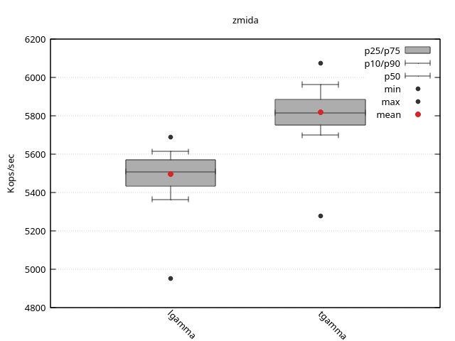

* zmida -- zig benchmarking harness

This is for benchmarking high performance, cpu bound code.

- arbitary argument functions
- by count or by time trials
- input by slice, array, single value, or generator
- same inputs to multiple functions
- TSC based timing if available
- perf_event counts (instr, cycles, branches)
- multiple output formats: text, csv, gnuplot

You supply a list of functions, a configuration, and
a list of argument tuples for each function to be called on.
For each function there is a warmup phase to prime
the caches, then the function is run repeatedly until
eithe a set number of times or specific count.

Then there are various output methods to either dump the
results to the screen or save them. Multiple output
methods may be used.

* Basic Concepts

Call: a function involed on a single argument

Sweep: a function run once over the argument list

Sample: timed one or more complete sweeps of a single
function over the argument list -- the smallest unit
of timed work. All stats are really based on the
these averages.

Trial: a single function and argument list and all
the samples recoded from it. Trials are either by
time or by count.

Study: a collection of trials using the same
configuration and same argument inputs. This allows
functions to be compared over the same workload.

A lot of the top level functions have some comptime

* Future direction

This are the next few thigs I want to work on:

- make some simple functions for most basic "bench this"
- add adaptive mode that run by-count trials by estimating workload
- better documentation
- gnuplot: less ugly output and chart options
- gnuplot: add basic bar (relative mode, perf events)
- perf counters for cache (also perf multiplexed adj)

* Example

#+BEGIN_SRC zig
  pub fn main(init: std.process.Init) !void {

      // generate benchmark inputs
      const N = 100;
      var xosh: std.Random.Xoshiro256 = .init(0);
      var rand = xosh.random();
      var args: [N]f64 = undefined;
      for (&args) |*x| {
          x.* = rand.float(f64) * 20;
      }

      // the functions to benchmark to a tuple
      const funcs = .{ lgamma, tgamma };

      // create a configuration with defaults
      const config = zm.TimedConfig{};
      // output a little exta and use RDTSC for timing
      zm.setGlobalOpts(.{ .verbose = 2, .use_tsc = true });

      // run the study
      // the allocator and io are used by the benchmark harness. these are no
      // the ones used by the passed in functions.
      // 
      var study = try zm.Study.run(init.gpa, init.io, null, config, funcs, args);
      defer study.deinit(); 

      // write the output, null mean to stdout
      try study.write_text(null, .{ .mode = .lat });
      try study.write_summary("example", .{ .separator = '\t' });
      try study.write_gnuplot("example", .{});
  }
#+END_SRC

Here is what the run looks like

#+BEGIN_EXAMPLE
Running study zmida
root.TimedConfig: .{ .warmup_nanos = 100000000, .trial_nanos = 1000000000, .trial_samples = 250 }
  Running trial 1/2
  Trial lgamma with 250 samples:
  Running trial 2/2
  Trial tgamma with 250 samples:
Generating stats for study zmida
default suite name
units: nanosec/op
clock: .tsc @ 1497600000 Hz
mode: latency (lower is better)
fn      |      calls  seconds    mean |   best     p75     p50     p25   worst
--------+-----------------------------+---------------------------------------
lgamma  |    5701300     1.04  181.95 | 175.80  179.51  181.56  184.06  201.97
tgamma  |    6026900     1.04  171.95 | 164.65  169.98  172.00  173.88  189.54
#+END_EXAMPLE

And here is the ugly gnnuplot -- I really need to make this look better

