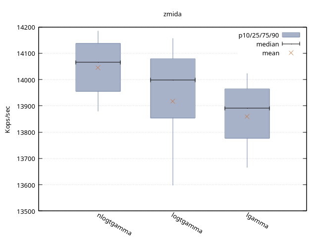
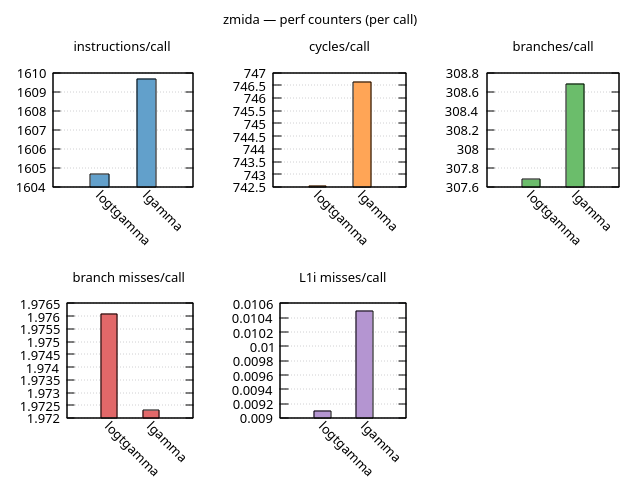

* zmida -- zig benchmarking harness

If you are seeing this as plain text,  it is related to an Oct 2nd GiHub bug:
https://github.com/github/markup/issues/2105
https://github.com/github/markup/pull/2106

Hopefully it is fixed soon

--

This is for benchmarking high performance, cpu bound code.

- arbitrary argument functions (zero, one, or many arguments)
- by count, by time, or adaptive trials (adaptive is the default)
- input by slice, array, single value, or generator
- same inputs to multiple functions
- TSC based timing if available, falls back to =clock_gettime=
- perf_event counts: instructions, cycles, branches, L1/LL cache
- multiple output formats: text, csv, gnuplot
- ability to pin cpu and set priority
- command line switches
- one-line =bench()= for quick looks, =Study= for full control

You supply a function (or a tuple of functions), a configuration, and
the arguments the functions are to be called on. For each function
there is a warmup phase to prime the caches, then the function is run
repeatedly in a series of timed samples. Perf counters are collected in
a separate run so they never disturb the timing samples.

Then there are various output methods to either dump the results to the
screen or save them. Multiple output methods may be used on the same study.

See [[./HOWTO.org][HOWTO.org]] for a walkthrough from the basics to the advanced options.

* Requirements

- Zig 0.16.0, or later
- Linux on x86-64. TSC timing uses =cpuid=/=rdtsc=, and pinning, priority and
  perf counters use Linux syscalls. Other platforms are not supported.
- For perf counters: =kernel.perf_event_paranoid= must be 2 or lower
  (only user-space is counted), and the CPU's PMU must be visible. Most VMs
  do not expose it.
- Build with =-Doptimize=ReleaseFast= (or ReleaseSafe) for real measurements.
  zmida warns loudly when compiled in Debug.

* Install

#+BEGIN_SRC sh
zig fetch --save <url-of-this-repo>
#+END_SRC

In your =build.zig=:

#+BEGIN_SRC zig
const zmida = b.dependency("zmida", .{ .target = target, .optimize = optimize });
exe.root_module.addImport("zmida", zmida.module("zmida"));
#+END_SRC

* Quick start

#+BEGIN_SRC zig
const std = @import("std");
const zm = @import("zmida");

pub fn main(init: std.process.Init) !void {
    const args = zm.gen.uniform(f64, 100, 0, 10, 0);
    try zm.bench(&init, .{ logtgamma, lgamma }, &args);
}

fn lgamma(x: f64) f64 {
    return std.math.lgamma(f64, x);
}

fn logtgamma(x: f64) f64 {
    return std.math.log(f64, std.math.e, std.math.gamma(f64, x));
}
#+END_SRC

=bench= takes the =init= from main, a function or a tuple of functions, and
the arguments. It runs each function over every argument and prints a latency table.

* A fuller example

When you want to choose the trial type, set global options, or write
more than text, use a =Study=:

#+BEGIN_SRC zig
// full source in examples/readme.zig
pub fn main(init: std.process.Init) !void {
    const funcs = .{ nlogtgamma, logtgamma, lgamma };
    const args = zm.gen.uniform(f64, 100, 0, 10, 0);

    zm.init(&init, .{
        .pin_cpu = 1,
        .perf_cpu = true,
    });
    const config: zm.Config = .byadapt(.{});
    var study = try zm.Study.run("gamma", config, funcs, &args);
    defer study.deinit();

    try study.write_text(null, .{ .mode = .thru });
    try study.write_gnuplot("gamma", .{}); // gamma.gp
    try study.write_gnuplot_perf("gamma", .{}); // gamma-perf.gp
}
#+END_SRC

Here is what the run looks like (text output goes to stdout, progress to stderr):

#+BEGIN_EXAMPLE
set cpu affinity to 1
Running study gamma
Adapt:
	- warmup millis: 1000
	- trial samples: 100
	- trial millis: 2000
	- perf millis: 2000
Running trial 1/3
Trial nlogtgamma warmup (1000.000ms)
timing samples 100 sweeps @ 282800 calls
Trial nlogtgamma cpu perf_events. 282717 sweeps
Running trial 2/3
Trial logtgamma warmup (1000.000ms)
timing samples 100 sweeps @ 269200 calls
Trial logtgamma cpu perf_events. 269102 sweeps
Running trial 3/3
Trial lgamma warmup (1000.000ms)
timing samples 100 sweeps @ 274300 calls
Trial lgamma cpu perf_events. 274261 sweeps
Generating stats for study gamma
study: gamma
compile: .ReleaseFast
units: Mops/sec
clock: .tsc @ 1497600000 Hz
display: throughput (higher is better)

fn          |      calls  seconds    mean |   best     p75     p50     p25   worst
------------+-----------------------------+---------------------------------------
nlogtgamma  |   28280000     2.01   14.04 |  14.28   14.14   14.07   13.95   13.52
logtgamma   |   26920000     1.93   13.92 |  14.25   14.08   14.00   13.85   13.00
lgamma      |   27430000     1.98   13.86 |  14.08   13.96   13.89   13.78   13.30

fn          |    ipc      insts     cycles    imiss |  miss/M     misses   branches
------------+---------------------------------------+------------------------------
nlogtgamma  |  1.798      548.8      305.1    0.002 |   12.04      0.001       76.3
logtgamma   |  1.796      548.8      305.6    0.003 |   18.30      0.001       76.3
lgamma      |  1.806      558.8      309.4    0.003 |   47.79      0.004       78.3
#+END_EXAMPLE

The gnuplot output (see the [[./HOWTO.org][HOWTO]] for how to render it):

* Command line switches

Any program that calls =zm.init= (or =bench=) accepts these. They override
the options passed in code. Values are attached with =-x=value=, not
=-x value=.

| switch                  | meaning                                   |
|-------------------------+-------------------------------------------|
| =-v=, =--verbose=N      | 0 silent, 1 normal, 2 trace               |
| =-t=, =--tsc=[on/off]   | use TSC for timing (on by default)        |
| =-c=, =--cpu=N          | pin to cpu N                              |
| =-n=, =--nice=N         | set niceness, -20 to 19 (negative needs root) |
| =-p=, =--perf=WHAT      | =cpu=, =mem=, or =both=                   |

zmida claims every argument that starts with =-=; unknown ones are an error.

* Examples

The =example/= directory has runnable programs:

| file          | shows                                                  |
|---------------+--------------------------------------------------------|
| =simple.zig=  | one-line =bench()= with one function and with several  |
| =basic.zig=   | a =Study= with perf counters and throughput output     |
| =gendata.zig= | multi-argument functions, =gen.tie=, =gen.LinSpace=    |
| =plots.zig=   | gnuplot output; comparing call styles (virtual calls)  |

#+BEGIN_SRC sh
zig build run-basic -Doptimize=ReleaseFast -- -c=1 -p=cpu
zig build examples        # build them all
#+END_SRC

* Basic Concepts

Call: a function invoked on a single argument

Sweep: a function run once over the argument list

Sample: timed one or more complete sweeps of a single
function over the argument list -- the smallest unit
of timed work. All stats are really based on these
averages.

Trial: a single function and argument list and all
the samples recorded from it. Trials are either by
time, by count, or adaptive.

Study: a collection of trials using the same
configuration and same argument inputs. This allows
functions to be compared over the same workload.

* Testing

#+BEGIN_SRC sh
zig build test
#+END_SRC

A few tests check the hardware itself (invariant TSC, cpufreq files in
=/sys=, affinity, priority). They may fail in VMs or containers.

* Future direction

These are the next few things I want to work on:

- better documentation and more examples
- better looking gnuplot output
- baseline (empty function) subtraction, after v1
- load_factor for when a function has a loop for the timed call

* AI

Various models have been used for code review, debugging assistance, the gnuplot
related code and files, documentation, and to generate test code.

* Ten Things I Hate About You

My ongoing love-hate thing with zig:

- [ ] a way per test, to signal this should be compiled and attached in the documentation
  but is not a test, it is an example
- [ ] anytype still sucks. I want `fn func(x: []const anytype)` as a minimum
- [ ] io is painfully overdone. Zig Io is J2EE Spring for C.
- [ ] io is painfully overdone. why do i need it to get time?
- [ ] casting casting everywhere and getting worse by the release
- [ ] no standard doc comment syntax
- [ ] build.zig way to print out where it put the binary without installing

* License

BSD 2-Clause. See [[./LICENSE][LICENSE]].
